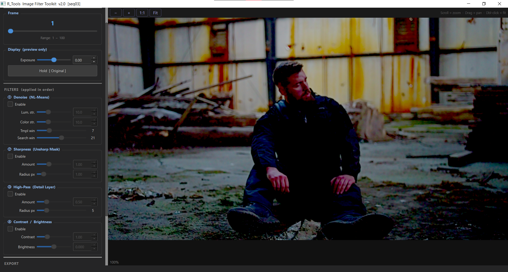
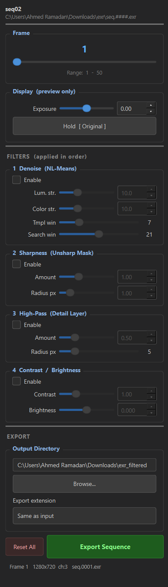
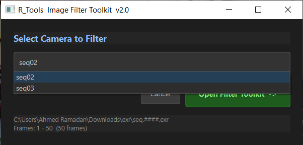

# 3DE Image Toolkit

Image Toolkit is a 3DEqualizer helper that lets you preview and export filtered image sequences directly from a camera in your current 3DE project.

It is designed for practical shot work: pick a camera, adjust filters visually, compare original vs filtered result, then export and relink the footage path back in 3DE.


<!-- 
## What Is In This Codebase

- `img_toolkit.py`: Main GUI tool used inside 3DEqualizer.
- `ImgToolkitProxyInit.py`: Proxy bootstrap script that launches the main tool from this repository path.
- `imgToolkit.py`: Small 3DE menu entry script that calls the proxy bootstrap.
- `install_3de_proxy_patch.ps1`: Installer that writes plugin scripts into your 3DE plugin folder and patches a static toolkit path.
- `install_uv_and_libs.bat`: One-click dependency installer into the local `libs` folder.
- `libs/`: Local Python dependencies used by the toolkit. -->

## Main Features

- Camera picker to choose which sequence to process.
- Real-time preview workflow with debounced updates for smooth interaction.
- Before/after comparison mode (hold original view).
- Zoom and pan controls in the preview viewer.
- Filter stack with simple controls:
  - Denoise
  - Sharpen
  - High-pass detail
  - Contrast and brightness
- Exposure control for preview display.
- Background frame loading and preview processing to keep UI responsive.
- Sequence export with progress feedback.
- Automatic update of 3DE camera sequence path after export.

<!--  -->


## How It Works (High Level)

1. Open the tool from 3DE.
2. Pick a camera from the current project.
3. Move through frames and tune filters until the look is right.
4. Export the filtered sequence to an output folder.
5. The tool updates the camera footage pattern in 3DE to point to the new files.




## Installation Guide

## Option A: Recommended (Automated)

1. Open PowerShell in this repository root.
2. Install dependencies into local `libs`:

```powershell
.\install_uv_and_libs.bat
```

   - The installer now prompts for the Python version (default: `3.11`).
   - The installer recreates `.venv` using the selected Python version before installing packages.
   - Dependencies are installed into versioned folders under `libs`, for example:
     - `libs\py311`
     - `libs\py37`
   - You can also pass arguments directly:

```powershell
.\install_uv_and_libs.bat 3.7 "C:\path\to\python.exe"
```

3. Install 3DE plugin scripts:

```powershell
.\install_3de_proxy_patch.ps1
```

4. When asked, enter your 3DE plugin scripts folder.
5. Restart 3DEqualizer (if already open).
6. Run the script named `Image Toolkit` from 3DE script menus.

## Option B: Manual

1. Ensure `libs` is populated with required packages.
2. Copy `imgToolkit.py` and `ImgToolkitProxyInit.py` into your 3DE plugin scripts folder.
3. Edit `IMG_TOOLKIT_ROOT` in `ImgToolkitProxyInit.py` to the absolute path of this repository.
4. Restart 3DE and launch `Image Toolkit`.

## Notes

- The tool expects dependencies to be available in `libs\pyXX` (for the active Python version).
- If your plugin path is under Program Files, run PowerShell as Administrator during install.
- If needed, you can override the toolkit path with the environment variable `IMG_TOOLKIT_ROOT`.
- On Python 3.7, if `openimageio` is unavailable, the installer automatically tries an `OpenEXR` fallback.

## Typical Usage Tips

- Start with subtle filter values, then increase gradually.
- Use the original/filtered compare button often while tuning.
- Export to a dedicated output folder per shot to keep versions clean.

## Troubleshooting

- Tool does not appear in 3DE:
  - Confirm `imgToolkit.py` exists in the configured 3DE plugin folder.
  - Restart 3DE after installation.
- Launch error about missing files:
  - Verify `IMG_TOOLKIT_ROOT` points to this repository.
- Denoise unavailable:
  - Re-run dependency installer to ensure OpenCV is present in `libs`.
- EXR load/save issues:
  - Re-run dependency installer for your target Python version.
  - For Python 3.7, EXR support may come from `OpenEXR` fallback when `OpenImageIO` wheels are not available.
